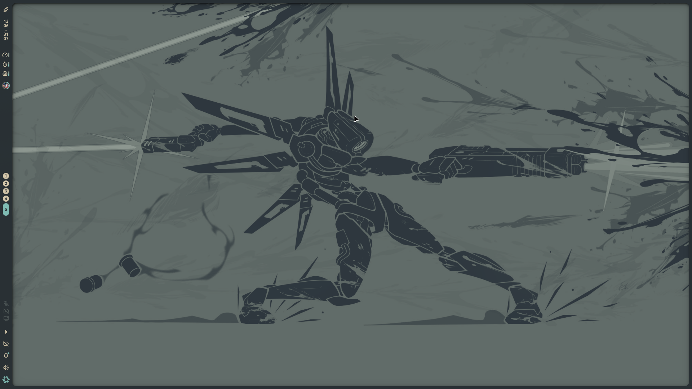
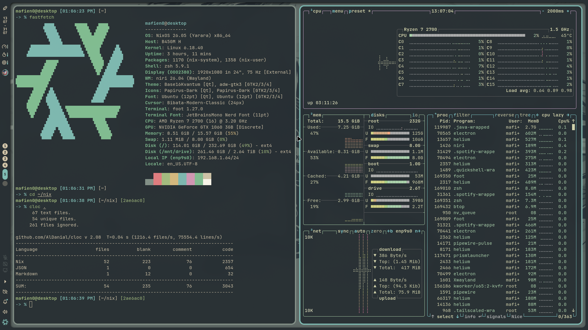
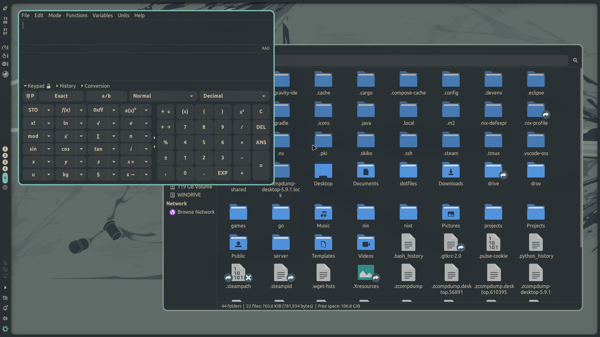
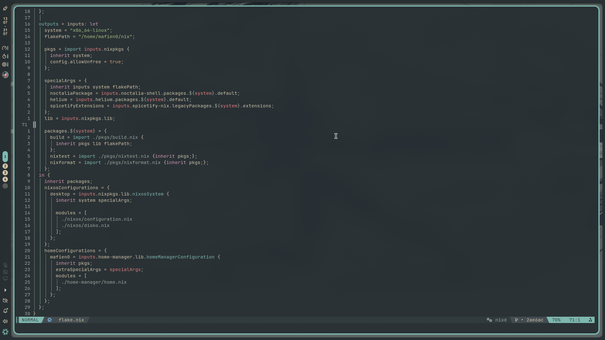

<h1 id="header" align="center">
    <pre>Dotfiles</pre>
</h1>

- uses stable nixos(26.05)
- Styled with `stylix`
- Formatted with `alejandra`
- Checked with `deadnix`, `statix` and `nixpkgs-lint`

## Screenshots

<table>
    <tr>
        <td></td>
        <td></td>
    </tr>
    <tr>
        <td></td>
        <td></td>
    </tr>
</table>

## Layout

```
flake.nix
install/            # not needed after first build
pkgs/               # exposed packages
hosts/*/            # per-system configuration
homeModules/        # shared modules(home-manager)
nixosModules/       # shared modules(nixos)
```
i try to put everything in home-manager first  
then if cannot i put it into nixos modules

## Install
You really shouldn't install this as your system configuration  
These dotfiles are heavily personalized for my system, configuration, choice and taste  
But you can use it as an example(not that these are good dotfiles)  
